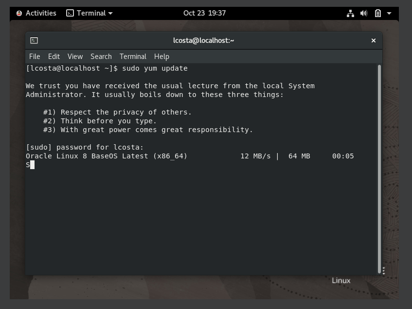
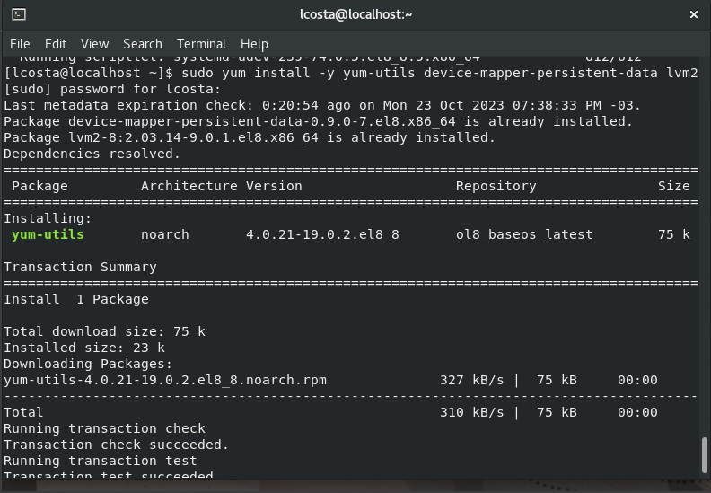
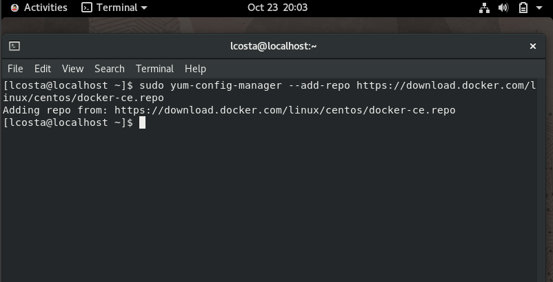
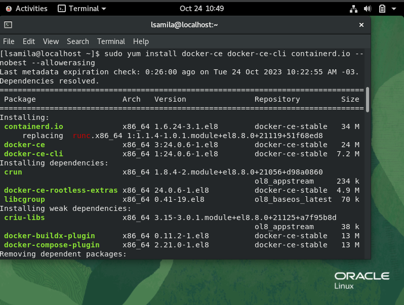
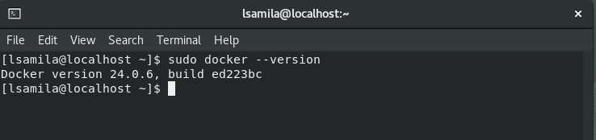
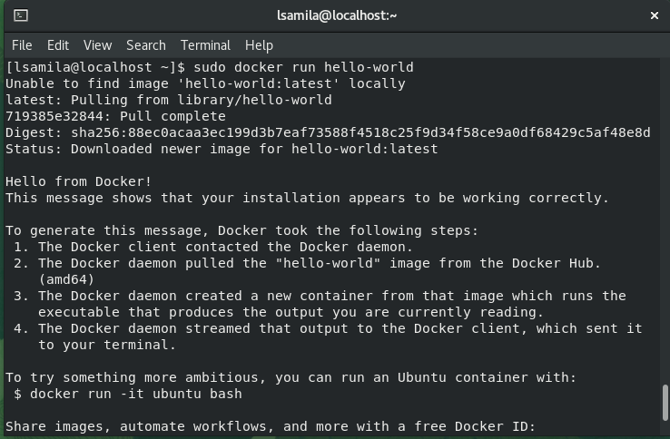

# Desafio 01 - Trilha DevSecOps na CompassUOL - Sprint 2

# Instalar Docker

### Configurações necessárias:

1. Atualize a lista de pacotes do sistema:

```
sudo yum update
```



2. Instale as **dependências** necessárias:

```
sudo yum install -y yum-utils
```



3. Adicione o repositório oficial do **Docker**:

```
sudo yum-config-manager --add-repo https://download.docker.com/linux/centos/docker-ce.repo
```



## Instalar Docker Engine

1. Instale o **Docker Engine, o containerd e o Docker Compose**:

```
sudo yum install docker-ce docker-ce-cli containerd.io --nobest --allowerasing
```



2. Depois de instalado, inicie e habilite o **Docker**:

```
sudo systemctl start docker
sudo systemctl enable docker
```

3. Verifique se o Docker foi instalado corretamente:

```
sudo docker --version
```



4. Teste o Docker executando um contêiner de exemplo, como o "Hello World":

```
sudo docker run hello-world
```




## Agora você instalou e iniciou o Docker Engine com sucesso.